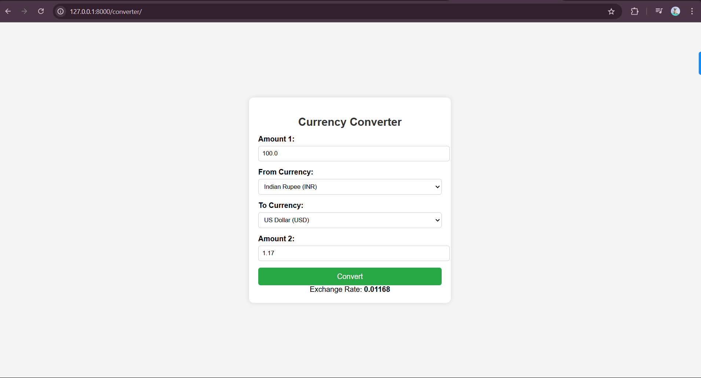

---

# 💱 Currency Converter

A simple and user-friendly Currency Converter built with Python and Django. This application allows users to convert values between two selected currencies based on real-time exchange rates.

---

## 🌐 Features

- Convert currency values from one currency to another
- Real-time exchange rate fetching
- Bi-directional conversion (Currency 1 → Currency 2 and vice versa)
- Dropdown selection of multiple currencies (e.g., INR, USD, EUR, GBP)
- Simple and clean UI with an intuitive form
- Displays exchange rate as an integer

---

## 🛠 Tech Stack

- **Frontend**: HTML, CSS (via Django templates)
- **Backend**: Python, Django
- **API**: Exchange rate data via an external API ([ExchangeRate-API](https://www.exchangerate-api.com/))

---

## 📸 Screenshots




---

## 🚀 How to Run Locally

### 1. Clone the Repository
```bash
git clone https://github.com/AtharvaMirajkar/CurrencyConverter.git
cd currency-converter
```

### 2. Create Virtual Environment (optional but recommended)
```bash
python -m venv venv
source venv/bin/activate   # On Windows: venv\Scripts\activate
```

### 3. Install Dependencies
```bash
pip install -r requirements.txt
```

### 4. Run the Django Server
```bash
python manage.py runserver
```

### 5. Access the App
Go to `http://127.0.0.1:8000` in your browser.

---

## ⚙️ Project Structure

```
.
├── CC_snap.png
├── CurrencyConverter     # project folder
│   └── CC # django project file
│       ├── CC     # main django folder
│       │   ├── __init__.py
│       │   ├── asgi.py
│       │   ├── settings.py
│       │   ├── urls.py
│       │   └── wsgi.py
│       ├── converter     # app folder
│       │   ├── __init__.py
│       │   ├── admin.py
│       │   ├── apps.py
│       │   ├── migrations
│       │   │   └── __init__.py
│       │   ├── models.py
│       │   ├── static
│       │   │   ├── css
│       │   │   │   └── style.css
│       │   │   └── favicon.ico
│       │   ├── templates
│       │   │   ├── base.html
│       │   │   ├── converter.html
│       │   │   └── index.html
│       │   ├── tests.py
│       │   ├── urls.py
│       │   └── views.py
│       ├── db.sqlite3
│       ├── manage.py
│       └── requirements.txt
├── LICENSE
└── README.md

```

---

## 📈 Future Improvements

- Add support for historical exchange rate tracking
- Add currency symbols and flags
- Implement currency charts and analytics
- Mobile-friendly responsive UI

---

## 📄 License
This project is licensed under the **MIT** License.
Feel free to use, share, and modify it as needed.

---

## 🙌 Acknowledgements

- [Django](https://www.djangoproject.com/)
- [ExchangeRate-API](https://www.exchangerate-api.com/)
- Open-source community ❤️

---

## 🤝 Contributing
Pull requests are welcome! For major changes, please open an issue first to discuss what you would like to change.

---

## 📬 Contact

If you have any suggestions, feedback, or would like to contribute, feel free to connect!

**Developer**: Atharva Mirajkar
**Email**: _atharva.r.mirajkar@gmail.com_  
**Linkedin**: _https://www.linkedin.com/in/mirajkar-atharva/_

---

## Thank You ❤️
